# Sully Chain - Supplier Management & Allocation System
## Comprehensive Architecture Document

---

## Executive Summary

**Sully Chain** is an advanced, allocation-based supplier management ecosystem designed to integrate seamlessly with the PHINS Insurance Platform. It provides a unified dashboard for managing diverse supplier types, handling service requests through competitive bidding, and maintaining an immutable ledger of all transactions and interactions.

### Key Capabilities
- **Multi-Type Supplier Registry**: Lawyers, doctors, medical service providers, reinsurance companies, banks, trading companies, delivery services, transportation providers, pharmacies
- **Allocation-Based Bidding**: Service requests generate allocation opportunities where registered suppliers submit fixed-price bids
- **Immutable Ledger**: Complete audit trail of every action, client interaction, and specialization
- **AI/BI Analytics**: Real-time insights, supplier performance scoring, fraud detection, and predictive analytics
- **NFT-Based Transaction Integrity**: Blockchain-verified transaction records for provenance and compliance

---

## 1. Database Schema (Entity Relationship Diagram)

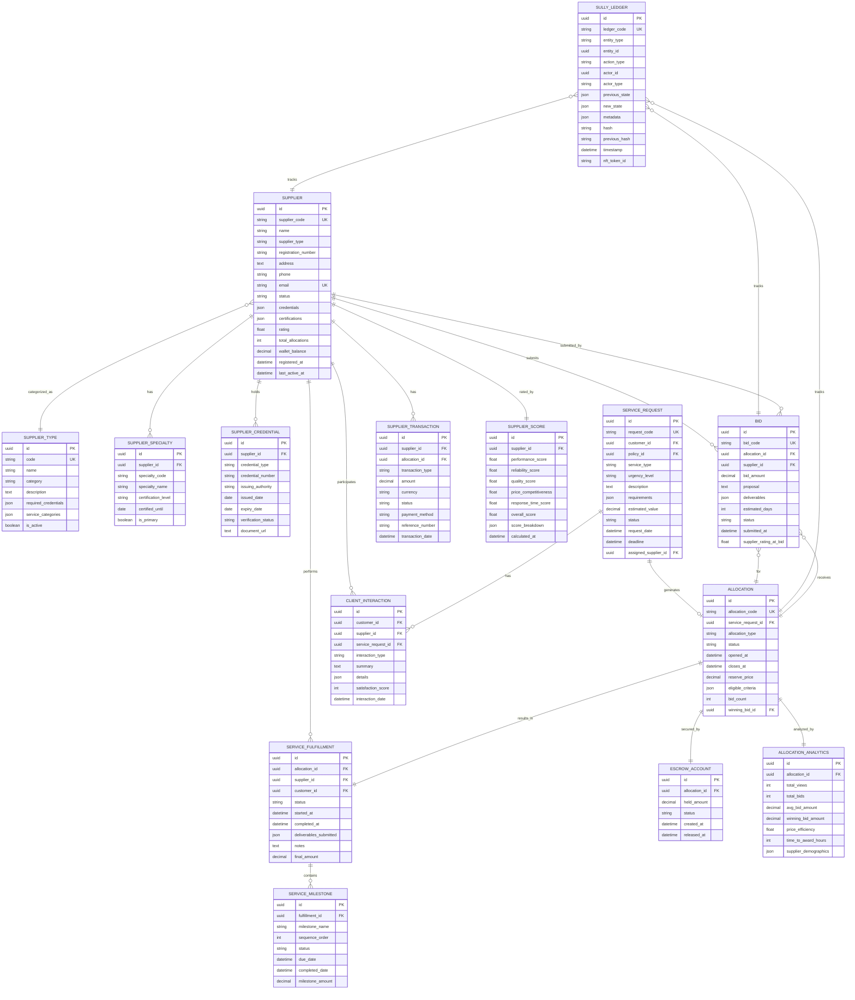

---

## 2. Supplier Type Hierarchy

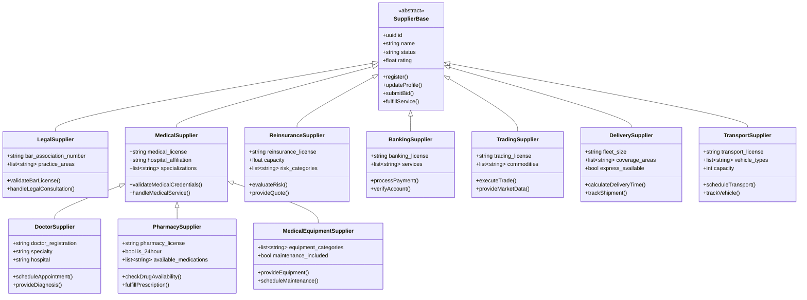

---

## 3. System Architecture (Component Diagram)

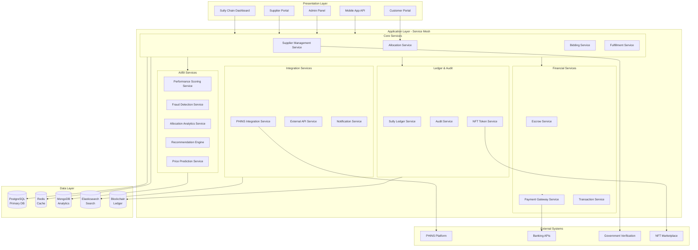

---

## 4. Allocation Workflow (Sequence Diagram)

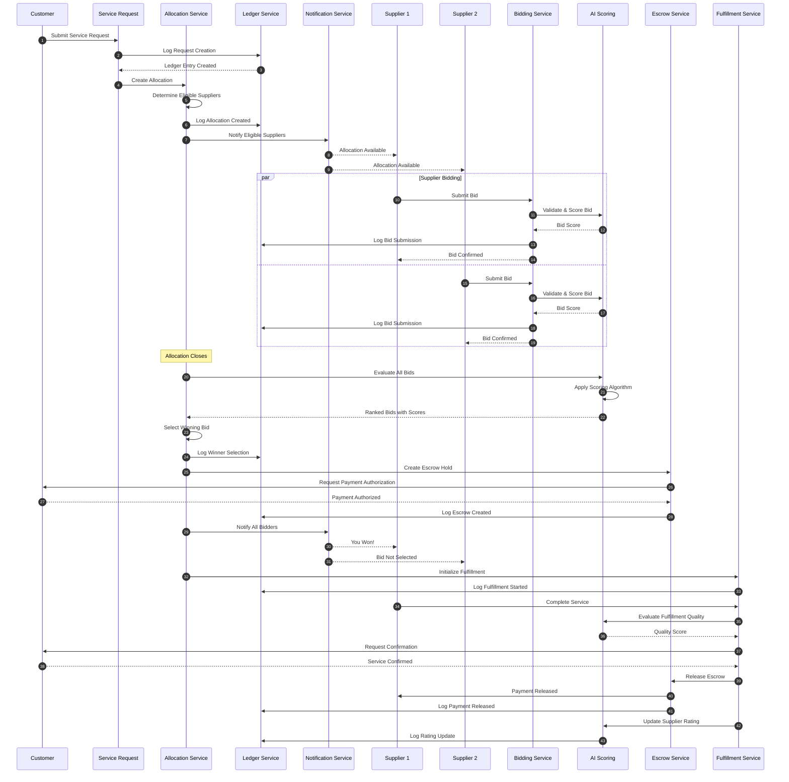

---

## 5. Ledger System Architecture

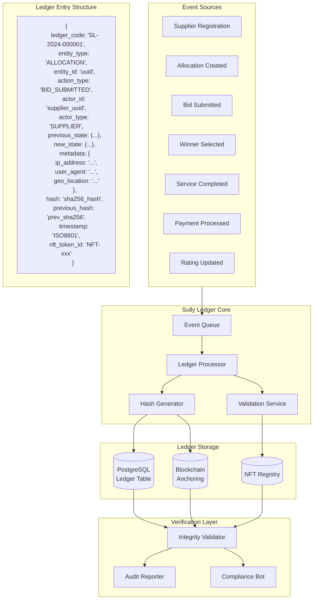

---

## 6. AI/BI Analytics Engine

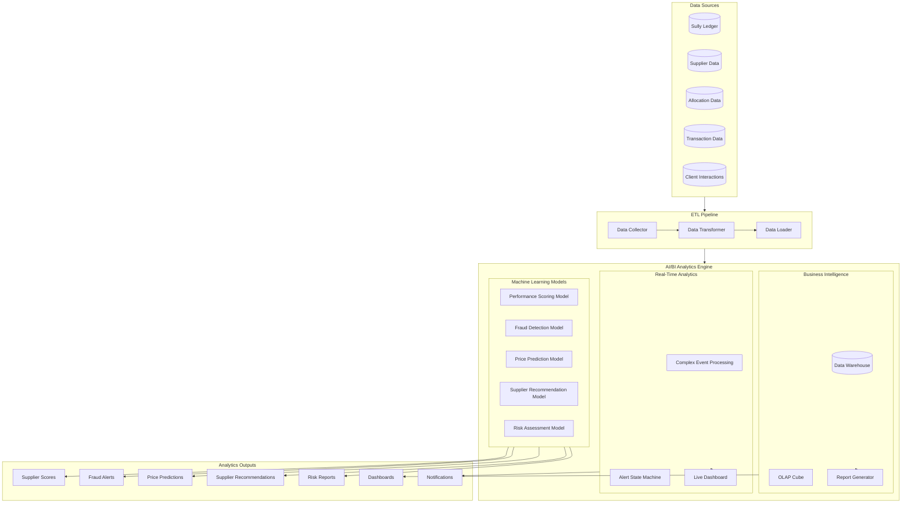

### AI Scoring Algorithm

```mermaid
flowchart LR
    subgraph Inputs["Scoring Inputs"]
        I1[Completion Rate]
        I2[Average Rating]
        I3[Response Time]
        I4[Price Competitiveness]
        I5[Dispute Rate]
        I6[Credential Status]
        I7[Years Active]
        I8[Total Allocations]
    end
    
    subgraph Weights["Dynamic Weights"]
        W1["Completion: 0.20"]
        W2["Rating: 0.25"]
        W3["Response: 0.15"]
        W4["Price: 0.15"]
        W5["Disputes: 0.10"]
        W6["Credentials: 0.05"]
        W7["Experience: 0.05"]
        W8["Volume: 0.05"]
    end
    
    subgraph Calculation["Score Calculation"]
        AGG[Weighted Aggregation]
        NRM[Normalization 0-100]
        ADJ[Recency Adjustment]
    end
    
    subgraph Output["Final Score"]
        FS["Overall Score<br/>Performance Tier<br/>Trend Indicator"]
    end
    
    Inputs --> Weights
    Weights --> Calculation
    Calculation --> Output
```

---

## 7. Service Layer Class Diagram

```mermaid
classDiagram
    class SullyChainService {
        <<interface>>
        +initialize()
        +shutdown()
        +health_check() HealthStatus
    }
    
    class SupplierManagementService {
        -supplier_repo: SupplierRepository
        -credential_validator: CredentialValidator
        -ledger: LedgerService
        +register_supplier(data: SupplierData) Supplier
        +update_supplier(id: uuid, data: SupplierData) Supplier
        +verify_credentials(supplier_id: uuid) VerificationResult
        +get_supplier_profile(id: uuid) SupplierProfile
        +search_suppliers(criteria: SearchCriteria) List~Supplier~
        +deactivate_supplier(id: uuid) bool
    }
    
    class AllocationService {
        -allocation_repo: AllocationRepository
        -supplier_matcher: SupplierMatcher
        -ledger: LedgerService
        +create_allocation(request: ServiceRequest) Allocation
        +get_eligible_suppliers(allocation_id: uuid) List~Supplier~
        +close_allocation(id: uuid) AllocationResult
        +cancel_allocation(id: uuid, reason: str) bool
        +get_allocation_status(id: uuid) AllocationStatus
    }
    
    class BiddingService {
        -bid_repo: BidRepository
        -validator: BidValidator
        -scorer: AIScorer
        -ledger: LedgerService
        +submit_bid(allocation_id: uuid, supplier_id: uuid, data: BidData) Bid
        +withdraw_bid(bid_id: uuid) bool
        +get_bids_for_allocation(allocation_id: uuid) List~Bid~
        +evaluate_bids(allocation_id: uuid) RankedBids
        +select_winner(allocation_id: uuid, bid_id: uuid) Bid
    }
    
    class FulfillmentService {
        -fulfillment_repo: FulfillmentRepository
        -milestone_tracker: MilestoneTracker
        -quality_assessor: QualityAssessor
        -ledger: LedgerService
        +start_fulfillment(allocation_id: uuid) Fulfillment
        +update_milestone(fulfillment_id: uuid, milestone_id: uuid, status: str) Milestone
        +submit_deliverables(fulfillment_id: uuid, deliverables: List) bool
        +complete_fulfillment(fulfillment_id: uuid) FulfillmentResult
        +dispute_fulfillment(fulfillment_id: uuid, reason: str) Dispute
    }
    
    class LedgerService {
        -ledger_repo: LedgerRepository
        -hash_generator: HashGenerator
        -nft_service: NFTService
        +log_event(event: LedgerEvent) LedgerEntry
        +get_history(entity_type: str, entity_id: uuid) List~LedgerEntry~
        +verify_integrity(from_date: datetime, to_date: datetime) IntegrityReport
        +export_audit_trail(criteria: AuditCriteria) AuditReport
        +anchor_to_blockchain(entry_id: uuid) BlockchainReceipt
    }
    
    class EscrowService {
        -escrow_repo: EscrowRepository
        -payment_gateway: PaymentGateway
        -ledger: LedgerService
        +create_escrow(allocation_id: uuid, amount: Decimal) Escrow
        +hold_funds(escrow_id: uuid) HoldResult
        +release_funds(escrow_id: uuid, recipient_id: uuid) ReleaseResult
        +refund_escrow(escrow_id: uuid) RefundResult
        +get_escrow_status(escrow_id: uuid) EscrowStatus
    }
    
    class SupplierScoringService {
        -score_repo: ScoreRepository
        -ml_model: PerformanceModel
        -ledger: LedgerService
        +calculate_score(supplier_id: uuid) SupplierScore
        +get_score_history(supplier_id: uuid) List~SupplierScore~
        +get_top_suppliers(category: str, limit: int) List~RankedSupplier~
        +recalculate_all_scores() BatchResult
    }
    
    class FraudDetectionService {
        -fraud_model: FraudModel
        -alert_service: AlertService
        -ledger: LedgerService
        +analyze_bid(bid: Bid) FraudScore
        +analyze_supplier_pattern(supplier_id: uuid) RiskAssessment
        +detect_collusion(allocation_id: uuid) CollusionReport
        +flag_suspicious_activity(entity_type: str, entity_id: uuid, reason: str) Alert
    }
    
    class RecommendationService {
        -rec_model: RecommendationModel
        -supplier_service: SupplierManagementService
        +recommend_suppliers(request: ServiceRequest) List~RecommendedSupplier~
        +predict_bid_range(allocation_id: uuid) PriceRange
        +suggest_optimal_deadline(request: ServiceRequest) datetime
    }
    
    SullyChainService <|.. SupplierManagementService
    SullyChainService <|.. AllocationService
    SullyChainService <|.. BiddingService
    SullyChainService <|.. FulfillmentService
    SullyChainService <|.. LedgerService
    SullyChainService <|.. EscrowService
    SullyChainService <|.. SupplierScoringService
    SullyChainService <|.. FraudDetectionService
    SullyChainService <|.. RecommendationService
    
    SupplierManagementService --> LedgerService
    AllocationService --> LedgerService
    BiddingService --> LedgerService
    FulfillmentService --> LedgerService
    EscrowService --> LedgerService
    SupplierScoringService --> LedgerService
    FraudDetectionService --> LedgerService
```

---

## 8. Integration with PHINS Platform

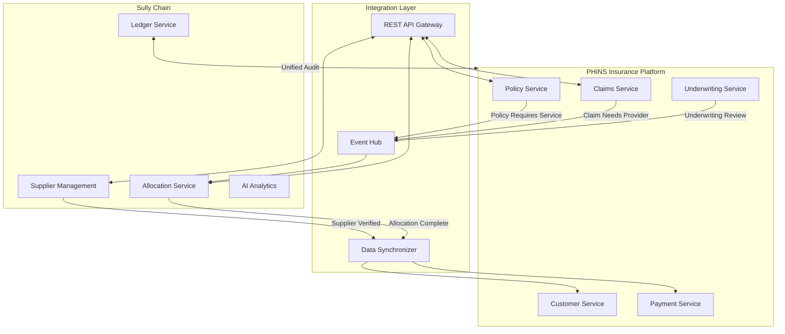

### Integration Events

| Event | Source | Target | Description |
|-------|--------|--------|-------------|
| `POLICY_SERVICE_REQUIRED` | PHINS Policy Service | Sully Allocation | Policy requires external service (medical exam, legal review) |
| `CLAIM_PROVIDER_NEEDED` | PHINS Claims Service | Sully Allocation | Claim requires provider (doctor, repair service) |
| `SUPPLIER_ASSIGNED` | Sully Allocation | PHINS Services | Supplier has been allocated to request |
| `SERVICE_COMPLETED` | Sully Fulfillment | PHINS Services | Supplier completed the service |
| `PAYMENT_PROCESSED` | Sully Escrow | PHINS Payment | Payment released to supplier |

---

## 9. Security Architecture

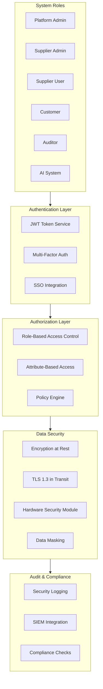

### Role Permissions Matrix

| Permission | Platform Admin | Supplier Admin | Supplier User | Customer | Auditor |
|------------|----------------|----------------|---------------|----------|---------|
| Manage Suppliers | ✓ | Own Only | - | - | View |
| Create Allocations | ✓ | - | - | ✓ | - |
| Submit Bids | - | ✓ | ✓ | - | - |
| View All Bids | ✓ | - | Own Only | Own Allocations | ✓ |
| Select Winners | ✓ | - | - | ✓ | - |
| Access Ledger | ✓ | Own Only | Own Only | Own Only | ✓ |
| View Analytics | ✓ | Own Only | - | - | ✓ |
| Manage Escrow | ✓ | - | - | - | View |

---

## 10. Dashboard Wireframe

```
┌─────────────────────────────────────────────────────────────────────────────┐
│  SULLY CHAIN - Supplier Management Dashboard                    👤 Admin ▼  │
├─────────────────────────────────────────────────────────────────────────────┤
│  📊 Overview │ 🏢 Suppliers │ 📋 Allocations │ 💰 Transactions │ 📈 Analytics │
├─────────────────────────────────────────────────────────────────────────────┤
│                                                                             │
│  ┌─────────────────┐ ┌─────────────────┐ ┌─────────────────┐ ┌────────────┐│
│  │ Active Suppliers│ │ Open Allocations│ │  Pending Bids   │ │ Escrow Held││
│  │      247       │ │       34        │ │       156       │ │  $2.4M     ││
│  │   ▲ 12% MTD    │ │   ▼ 5% MTD     │ │   ▲ 23% MTD    │ │  ▲ 8% MTD  ││
│  └─────────────────┘ └─────────────────┘ └─────────────────┘ └────────────┘│
│                                                                             │
│  ┌─────────────────────────────────────┐ ┌─────────────────────────────────┐│
│  │ Recent Allocations                  │ │ Top Suppliers by Score          ││
│  │ ─────────────────────────────────── │ │ ─────────────────────────────── ││
│  │ AL-2024-0892 Medical Exam    🟢 Open│ │ 1. HealthFirst Medical    98.5  ││
│  │ AL-2024-0891 Legal Review    🟡 Bid │ │ 2. Swift Delivery Co      97.2  ││
│  │ AL-2024-0890 Equipment       🔵 Won │ │ 3. LegalEase Partners     96.8  ││
│  │ AL-2024-0889 Transport       🟢 Open│ │ 4. MedEquip Solutions     95.4  ││
│  │ AL-2024-0888 Pharmacy        ✅ Done│ │ 5. SecureBank Financial   94.1  ││
│  └─────────────────────────────────────┘ └─────────────────────────────────┘│
│                                                                             │
│  ┌─────────────────────────────────────────────────────────────────────────┐│
│  │ Allocation Trends (Last 30 Days)                                        ││
│  │  ^                                                                      ││
│  │  │     ╭──╮                                      ╭───╮                  ││
│  │  │    ╱    ╲    ╭──────╮                       ╱     ╲                 ││
│  │  │───╱      ╲──╱        ╲─────────────────────╱       ╲────           ││
│  │  │                                                                      ││
│  │  └──────────────────────────────────────────────────────────────────▶  ││
│  │    Week 1      Week 2      Week 3      Week 4                          ││
│  └─────────────────────────────────────────────────────────────────────────┘│
│                                                                             │
│  ┌─────────────────────────────────────┐ ┌─────────────────────────────────┐│
│  │ Supplier Distribution by Type       │ │ Recent Ledger Activity          ││
│  │                                     │ │ ─────────────────────────────── ││
│  │      Medical 28%  ████████          │ │ 10:45 BID_SUBMITTED  AL-0892    ││
│  │        Legal 18%  █████             │ │ 10:42 SUPPLIER_REG   SP-1247    ││
│  │     Delivery 15%  ████              │ │ 10:38 ESCROW_CREATED AL-0891    ││
│  │      Banking 12%  ███               │ │ 10:35 WINNER_SELECT  AL-0889    ││
│  │        Other 27%  ███████           │ │ 10:30 SERVICE_DONE   AL-0885    ││
│  └─────────────────────────────────────┘ └─────────────────────────────────┘│
│                                                                             │
└─────────────────────────────────────────────────────────────────────────────┘
```

---

## 11. API Specification Summary

### Supplier Management APIs

| Endpoint | Method | Description |
|----------|--------|-------------|
| `/api/v1/suppliers` | POST | Register new supplier |
| `/api/v1/suppliers/{id}` | GET | Get supplier profile |
| `/api/v1/suppliers/{id}` | PUT | Update supplier |
| `/api/v1/suppliers/{id}/credentials` | POST | Add credential |
| `/api/v1/suppliers/{id}/verify` | POST | Trigger verification |
| `/api/v1/suppliers/search` | POST | Search suppliers |

### Allocation APIs

| Endpoint | Method | Description |
|----------|--------|-------------|
| `/api/v1/allocations` | POST | Create allocation |
| `/api/v1/allocations/{id}` | GET | Get allocation details |
| `/api/v1/allocations/{id}/bids` | GET | List bids |
| `/api/v1/allocations/{id}/bids` | POST | Submit bid |
| `/api/v1/allocations/{id}/winner` | POST | Select winner |
| `/api/v1/allocations/{id}/close` | POST | Close allocation |

### Ledger APIs

| Endpoint | Method | Description |
|----------|--------|-------------|
| `/api/v1/ledger/entries` | GET | Query ledger entries |
| `/api/v1/ledger/entities/{type}/{id}` | GET | Get entity history |
| `/api/v1/ledger/audit-report` | POST | Generate audit report |
| `/api/v1/ledger/verify-integrity` | POST | Verify chain integrity |

---

## 12. Deployment Architecture

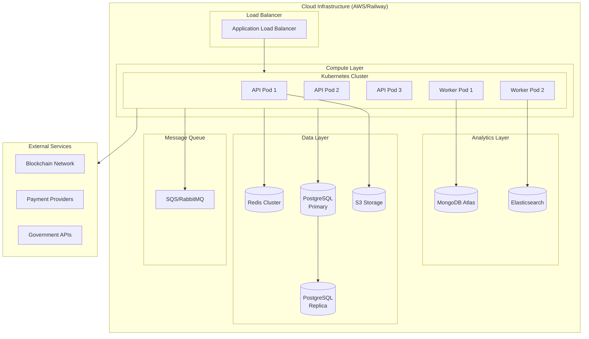

---

## 13. Implementation Phases

### Phase 1: Foundation (Weeks 1-4)
- [ ] Database schema implementation
- [ ] Core supplier management service
- [ ] Basic allocation workflow
- [ ] Ledger service foundation
- [ ] Authentication/Authorization

### Phase 2: Bidding & Fulfillment (Weeks 5-8)
- [ ] Complete bidding system
- [ ] Escrow service integration
- [ ] Fulfillment tracking
- [ ] Milestone management
- [ ] Notification system

### Phase 3: AI/BI Integration (Weeks 9-12)
- [ ] Supplier scoring algorithm
- [ ] Fraud detection model
- [ ] Recommendation engine
- [ ] Analytics dashboard
- [ ] Reporting system

### Phase 4: Advanced Features (Weeks 13-16)
- [ ] NFT integration for ledger
- [ ] Blockchain anchoring
- [ ] Mobile API
- [ ] Advanced analytics
- [ ] PHINS deep integration

---

## 14. Technology Stack

| Layer | Technology | Purpose |
|-------|------------|---------|
| **Frontend** | React/Vue.js | Dashboard UI |
| **API Gateway** | Flask/FastAPI | REST endpoints |
| **Services** | Python 3.11+ | Business logic |
| **ORM** | SQLAlchemy | Database abstraction |
| **Primary DB** | PostgreSQL 15 | Transactional data |
| **Cache** | Redis | Session, caching |
| **Analytics DB** | MongoDB | Time-series, analytics |
| **Search** | Elasticsearch | Full-text search |
| **Queue** | RabbitMQ/SQS | Async processing |
| **ML Framework** | scikit-learn/TensorFlow | AI models |
| **Blockchain** | Ethereum/Polygon | Ledger anchoring |
| **Monitoring** | Prometheus/Grafana | Observability |

---

## Conclusion

The Sully Chain architecture provides a comprehensive, scalable, and secure supplier management ecosystem that seamlessly integrates with the PHINS Insurance Platform. Key architectural decisions include:

1. **Modular Service Design**: Each capability is encapsulated in dedicated services for maintainability
2. **Event-Driven Architecture**: Enables loose coupling and real-time processing
3. **Immutable Ledger**: Provides complete audit trail with blockchain anchoring
4. **AI-First Analytics**: Embedded intelligence for scoring, fraud detection, and recommendations
5. **Multi-Tenant Security**: Role-based access with attribute-level permissions

This architecture supports the full lifecycle of supplier management from registration through service fulfillment, with complete transparency and accountability at every step.

---

*Document Version: 1.0*  
*Last Updated: January 2026*  
*Author: PHINS Architecture Team*
