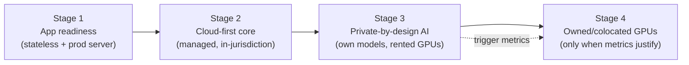
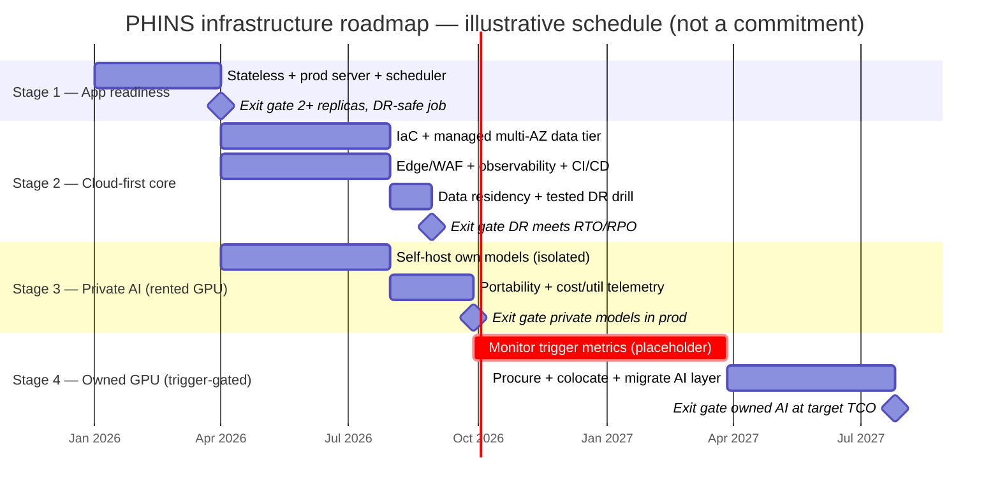

# PHINS Staged Infrastructure Roadmap

**Status:** Strategy / advisory document (no code changes)
**Audience:** Founders, engineering leadership, diligence reviewers, appointed
actuary / regulator conversations.
**Scope:** How PHINS should evolve its infrastructure from today's PaaS-hosted
monolith toward a compliant, resilient, autonomous insurer/MGA platform with a
**private AI capability** — and the concrete signals for when to graduate the AI
workload from rented GPUs to owned/colocated hardware.

---

## Guiding principle

> Build cloud-first now. Earn the right to go private later.

The "private super AI server, fully autonomous, own-everything" vision is a
**destination, not a starting point.** The fastest path to a top-tier platform
is cloud-first, in-jurisdiction, managed infrastructure with a **deliberately
isolated, portable AI layer** that can later move onto owned GPUs once volume
justifies it.

Two facts about PHINS make this strategy safe:

1. **The AI layer "recommends but never posts."** Derived AI/BI never writes to
   the append-only, hash-chained ledger. This lets the AI workload be
   network-isolated and sit *outside the regulated blast radius* — so a private
   AI server never inherits the ledger's compliance/DR burden, and the ledger
   never inherits the AI's hardware volatility.
2. **Multi-jurisdiction from the start (IL · CA · US).** Data residency and
   material-outsourcing rules dominate the "where does it run" decision. This
   favors in-region managed hosting and argues against a single central
   self-managed datacenter serving all three markets.

### The anti-pattern to avoid at all costs

Do **not** put the financial ledger and the AI server on the same self-managed
box "to be independent." That trades a manageable vendor dependency for an
existential reliability and compliance risk. Independence is bought with scale
and revenue — it is not a starting condition.

---

## Stage overview

| Stage | Goal | Compute posture | Exit gate (must be true to advance) |
|---|---|---|---|
| 1 | App readiness | current PaaS | app is stateless, prod server in front, scheduler externalized |
| 2 | Cloud-first regulated core | managed cloud, one region per jurisdiction | multi-AZ DB + PITR backups + tested DR + audit in place |
| 3 | Private-by-design AI | rented GPUs, isolated | own model weights + data; AI reads snapshots, never writes ledger |
| 4 | Owned/colocated AI | owned/colo GPUs | trigger metrics below are sustained, not spiky |

---

## Stage 1 — Fix the app before the infrastructure

**Why first:** Today the platform keeps state in process-local memory, runs on a
raw `BaseHTTPRequestHandler`, and schedules the monthly job in-process. On *any*
infrastructure — cloud, colo, or a private server — that cannot safely scale
past one instance and has no real DR story. This stage is the true bottleneck;
nothing downstream matters until it is done.

**Milestones**

- **M1.1 — Statelessness:** move all runtime state out of process-local memory
  (sessions, per-request caches, any in-memory business state) into a shared
  store; every business fact is DB-backed.
- **M1.2 — Production web server:** front the app with a production-grade
  WSGI/ASGI server (or migrate off raw `BaseHTTPRequestHandler`) supporting
  graceful shutdown, concurrency, and backpressure.
- **M1.3 — Externalized scheduler:** monthly auto-pay runs as a single external
  scheduled job (never an in-process thread on scaled web replicas).
- **M1.4 — 12-factor config:** all secrets/config from environment only; no
  environment-specific values baked into images.

**Exit gate:** the app runs correctly with **2+ replicas behind a load
balancer**, a rolling restart drops zero sessions, and the monthly job runs
exactly once regardless of replica count.

---

## Stage 2 — Cloud-first, in-jurisdiction, managed

**Why:** Managed cloud delivers multi-AZ resilience, backups/PITR, secrets
management, and audit primitives out of the box — the fastest route to
"top-1% reliability" with opex instead of capex, and the easiest posture to show
regulators a governed, auditable, DR-tested platform.

**Provider note:** AWS is a fine default but **not required**. Azure, GCP, or an
Israeli/Canadian sovereign-cloud region are equally valid. Choose the region per
first filing jurisdiction to satisfy data residency. What is non-negotiable is
*multi-AZ + tested DR + PITR + audit*, not the brand.

**Milestones**

- **M2.1 — Infrastructure-as-Code:** all resources defined in Terraform/CDK with
  remote state and per-environment separation (dev/staging/prod).
- **M2.2 — Managed data tier:** regulated Postgres on a managed, multi-AZ service
  with automated backups + point-in-time recovery; shared cache for sessions;
  object storage (versioned, encrypted) for documents, generated PDFs, ledger
  persistence, and backups.
- **M2.3 — Edge & network:** load balancer + CDN + WAF in front; private subnets
  for app and DB; least-privilege security groups; secrets in a managed secrets
  store; encryption at rest via managed keys.
- **M2.4 — Observability & CI/CD:** centralized structured logs, metrics,
  tracing, alarms, and a health-check canary; image registry + blue/green (or
  rolling) deploys with automatic rollback.
- **M2.5 — Data residency:** each jurisdiction's regulated data is stored in an
  approved in-region location; outsourcing/vendor governance documented.

**Exit gate:** a **tested DR drill** meets target RTO/RPO; backups are restorable
on demand; the ledger's hash chain reconciles after a simulated failover.

---

## Stage 3 — Private-by-design AI on rented GPUs

**Why:** You get real "private AI" — you own the model weights and the data —
**without** owning hardware. "Private" means control of model and data, not
control of the metal. Running on rented GPUs keeps capital free and lets you
scale elastically while you learn your true inference volume.

**Milestones**

- **M3.1 — Own the models:** self-host your own model weights (underwriting,
  claims triage, fraud, BI recommendations); no dependence on an external
  inference API for core decisions.
- **M3.2 — Isolation boundary:** the AI layer is network-isolated from the
  ledger. It consumes **read-only snapshots** and returns recommendations only —
  it never writes to `platform_ledger_entries` (preserves "recommend, never
  post").
- **M3.3 — Portable packaging:** the AI layer is containerized behind a stable
  internal interface so it can be relocated to different GPUs/hosts as a
  lift-and-shift of one component, not a re-platforming.
- **M3.4 — Cost & utilization telemetry:** capture the trigger metrics below
  (GPU-hours, utilization, monthly rented-GPU spend, latency) from day one so the
  Stage 4 decision is data-driven.

**Exit gate:** private models serve production recommendations from an isolated,
portable service; utilization and cost telemetry are being recorded.

---

## Stage 4 — Owned / colocated GPUs (only when the math forces it)

**Why:** Renting GPUs is fast and elastic but expensive for steady, high-volume
inference. Owning/colocating wins on unit economics **only** at sustained scale,
and adds capex plus datacenter/colo/SRE staffing. Because Stage 3 made the AI
layer portable and isolated, this is a controlled migration of a single
component — not a company-wide re-platforming.

### Trigger metrics — move from rented to owned GPUs when the majority hold, and are *sustained* (not spiky)

| Signal | Move-to-owned threshold (guideline) | Why it matters |
|---|---|---|
| **GPU utilization** | Sustained **> 65–70%** average over a rolling 90-day window | Below this, elasticity of rental beats owned idle capacity |
| **TCO crossover** | Owned all-in TCO (hardware amortized + power + colo + staff) **< ~60–70%** of equivalent rented spend, modeled over a 24–36 month horizon | Owning only wins when it is clearly cheaper, not marginally |
| **Steady monthly GPU spend** | Rented-GPU bill is **large, predictable, and rising**, not spiky | Predictable steady load is the case owning is designed for |
| **Workload stability** | Model/hardware refresh cadence is slow enough that owned hardware won't be stranded before amortization | Fast model churn favors rental |
| **Data sovereignty / vendor-independence requirement** | A regulator or strategic mandate requires infrastructure-level control beyond what a compliant cloud region provides | Compliance/strategy can justify owning even before pure cost crossover |
| **Ops readiness** | You have (or can hire) datacenter/colo + SRE + hardware-security staff to run owned GPUs at the same reliability as the cloud baseline | Owning without this staff regresses reliability |

### Guardrails

- **Colocate before you build.** Prefer a Tier-III+ colocation facility over a
  self-built room; you get power/cooling/physical security without owning a
  building.
- **Move the AI layer only — never the ledger.** The regulated system-of-record
  stays on the managed, multi-AZ, in-jurisdiction core from Stage 2. Stage 4
  relocates *only* the isolated AI component.
- **Keep a cloud burst path.** Retain the ability to spill overflow inference to
  rented GPUs for peaks, so owned capacity is sized to steady-state, not peak.

**Exit gate:** owned/colocated AI serves steady-state inference at or below the
modeled TCO, meets the Stage 2 reliability baseline, and the ledger core remains
untouched on managed cloud.

---

## Cost estimates (illustrative)

> **Read this first.** All figures below are **illustrative, order-of-magnitude
> planning ranges in USD** — not quotes or commitments. They exist to size the
> decision, not to budget it. Validate every line against real vendor quotes and
> your own scope before use.

**Assumptions**

- **Personnel** = fully loaded cost (salary + benefits + overhead). Blended
  senior engineer ≈ **$15k–20k / FTE-month** (US); materially lower in IL and
  several other markets (≈ $10k–14k). "Build" = the one-time project effort to
  reach a stage's exit gate; "Ongoing" = the steady-state team to run it.
- **Cloud** costs assume a **single primary in-jurisdiction region first**. Each
  additional regulated region roughly adds a large fraction of the core
  data-tier cost (residency = duplicated managed data tiers).
- **Rented GPU** assumes H100/A100-class instances: on-demand ≈ **$2–4 / GPU-hr**;
  committed/reserved materially cheaper.
- **Owned GPU** capex assumes H100-class servers ≈ **$250k–400k per 8-GPU node**,
  before networking, storage, and setup.
- Ranges widen with scale, multi-region footprint, and compliance depth.

### Stage 1 — App readiness

| Category | Type | Illustrative range | Notes |
|---|---|---|---|
| Hardware | — | $0 | Uses existing PaaS |
| Cloud / infra | Recurring | +$100–500 / mo | Add a shared cache (managed Redis); keep current PaaS |
| Software / tooling | Recurring | $0–500 / mo | CI, error tracking, existing tools |
| AI compute / tokens | — | negligible | Dev-time coding assistants only |
| Personnel — build | One-time | **$60k–160k** | 2–3 backend engineers + fractional architect; ~4–8 engineer-months |
| Personnel — ongoing | Recurring | absorbed by existing team | No new steady-state headcount |

### Stage 2 — Cloud-first regulated core

| Category | Type | Illustrative range | Notes |
|---|---|---|---|
| Hardware | — | $0 | Fully managed cloud |
| Cloud / infra | Recurring | **$3k–12k / mo** ($40k–150k / yr) | Multi-AZ managed Postgres, cache, object storage, LB/CDN/WAF, one region |
| Software / tooling | Recurring | $1k–5k / mo | Observability (e.g. Datadog-class), security tooling |
| AI compute / tokens | — | n/a | — |
| Personnel — build | One-time | **$120k–300k** | Cloud/DevOps + SRE; ~6–12 engineer-months (IaC, data tier, DR) |
| Compliance / legal | One-time | $20k–80k | Data-residency + outsourcing governance per jurisdiction |
| Personnel — ongoing | Recurring | ~1 SRE/DevOps FTE ($180k–240k / yr) | Run-rate for the managed core |

### Stage 3 — Private-by-design AI on rented GPUs

| Category | Type | Illustrative range | Notes |
|---|---|---|---|
| Hardware | — | $0 | GPUs are rented, not owned |
| Rented GPU compute | Recurring | **$10k–60k / mo** ($120k–720k / yr) | Always-on small cluster (2–8 GPUs); scales with volume |
| Tokens (fallback) | Recurring | $0–20k / mo | Only if any hosted-inference fallback is used during ramp |
| Software / tooling | Recurring | $1k–5k / mo | Model-serving stack (open-source: vLLM/Triton), vector DB, MLOps monitoring |
| Personnel — build | One-time | **$120k–300k** | 2–3 ML/MLOps + data engineer; ~6–12 engineer-months |
| Personnel — ongoing | Recurring | 1–2 MLOps FTEs ($180k–420k / yr) | Model ops, retraining, evals |

### Stage 4 — Owned / colocated GPUs (trigger-gated)

| Category | Type | Illustrative range | Notes |
|---|---|---|---|
| GPU hardware | Capex | **$0.5M–3M** | 2–4 H100-class nodes; excludes network fabric + storage |
| Network + storage | Capex | $100k–500k | High-speed fabric (InfiniBand-class), fast shared storage |
| Colocation + power | Recurring | **$5k–30k / mo** | Rack + power + cooling; GPU racks draw ~10kW+ |
| Software / tooling | Recurring | $1k–5k / mo | Same serving stack + hardware-management tooling |
| Personnel — build | One-time | $80k–200k | Procurement, install, migration of the AI layer |
| Personnel — ongoing | Recurring | +1–3 FTEs (DC ops / HW-security + expanded SRE) | $200k–600k / yr |
| Amortization | Non-cash | capex ÷ ~36 mo | Straight-line over ~3-year refresh horizon |

### Consolidated view

| Stage | One-time build (illustrative) | Recurring run-rate, annualized (infra + ongoing team) | Dominant cost driver |
|---|---|---|---|
| 1 | $60k–160k | ~$0–10k infra delta (team absorbed) | Backend engineering |
| 2 | $140k–380k (incl. compliance) | $90k–350k | Cloud infra + DevOps |
| 3 | $120k–300k | $300k–1.1M | Rented GPU compute + MLOps |
| 4 | $0.6M–3.5M capex + $80k–200k | $260k–1.0M (excl. amortization) | GPU hardware capex |

**Key economic takeaways**

- Stages 1–2 are **engineering-cost dominated** with modest, predictable infra
  run-rate — the cheapest, highest-leverage work.
- Stage 3's cost is **almost entirely rented GPU compute + ML personnel**, which
  scales with usage — exactly the signal Stage 4 watches.
- Stage 4 flips the model to **capex-heavy**: it only makes economic sense once
  the Stage-4 trigger metrics show sustained utilization that beats rental TCO.
  Until then, the money is better spent on rented elasticity.

---

## Illustrative delivery schedule (Gantt)

> **Timings are illustrative planning figures**, assuming one small dedicated
> team, and will shift with staffing, scope, and regulatory review cycles.
> Stages 2 and 3 overlap by design (Stage 3 can begin during Stage 2). **Stage 4
> is trigger-gated, not calendar-gated** — its start depends on the Stage-4
> metrics being sustained, not on a date. The "monitor trigger metrics" bar is a
> placeholder window, not a committed duration.

---

## One-page summary

- **Now:** make the app stateless and production-grade (Stage 1). This is the
  real blocker.
- **Next:** run the regulated core on managed, multi-AZ, in-jurisdiction cloud
  with IaC, backups, DR, and observability (Stage 2). AWS optional, not required.
- **In parallel with revenue growth:** run your own models on rented GPUs,
  isolated from the ledger and packaged to be portable (Stage 3).
- **Only when the trigger metrics are sustained:** graduate the AI layer onto
  owned/colocated GPUs (Stage 4) — moving one component, never the ledger.

**Bottom line:** AWS is *sufficient* but not *necessary*. What is necessary is a
high-assurance, in-jurisdiction, DR-tested home for the ledger, plus controlled
GPU capacity for the private AI — kept deliberately separate. A private AI server
is a great idea; a private *everything* server is not.
