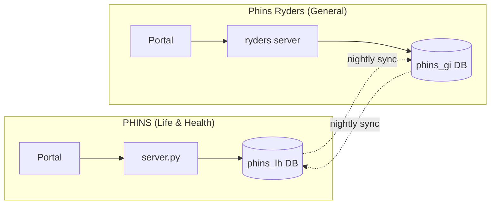
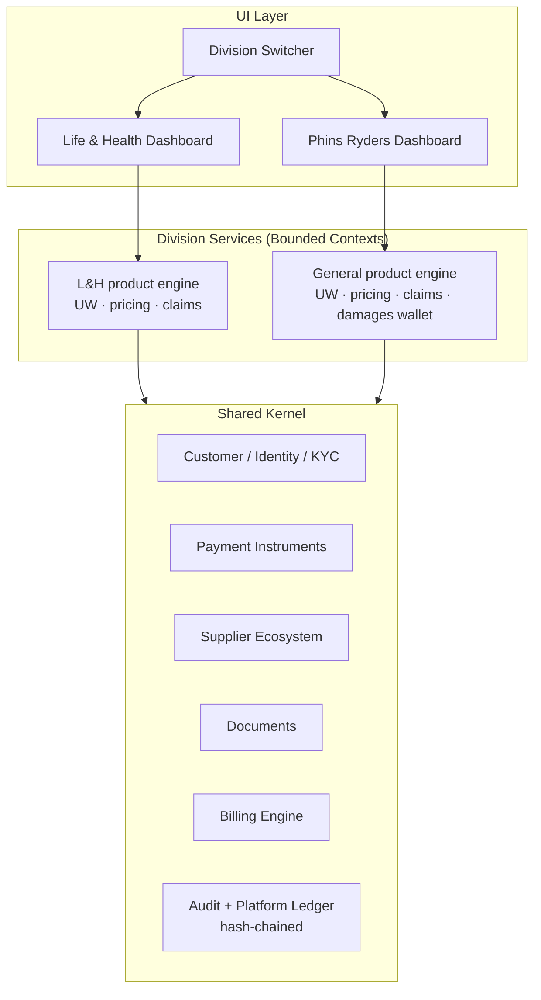
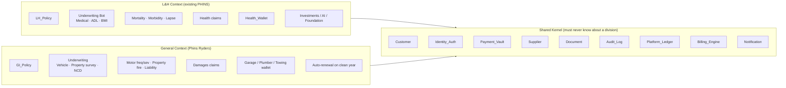
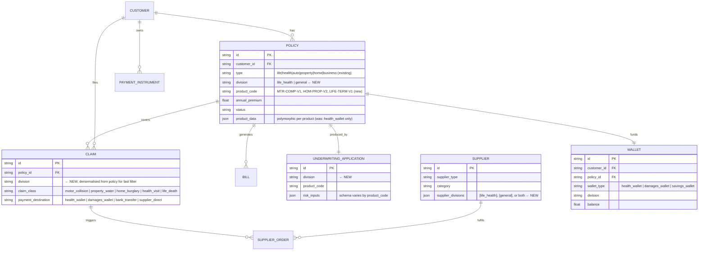
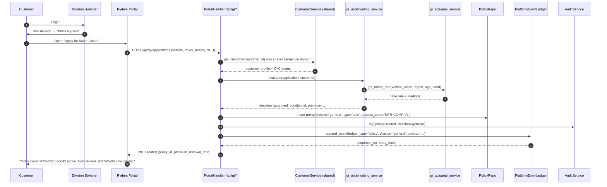
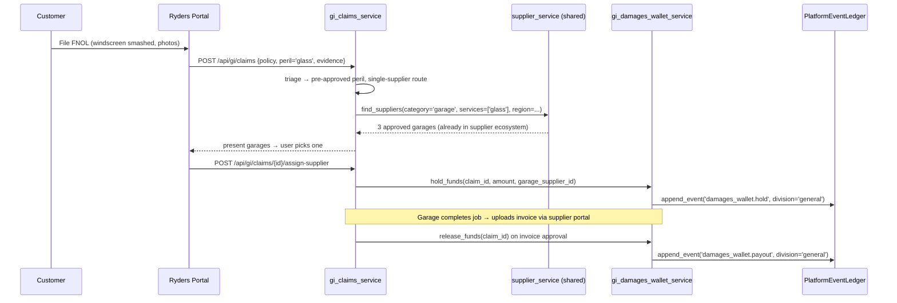
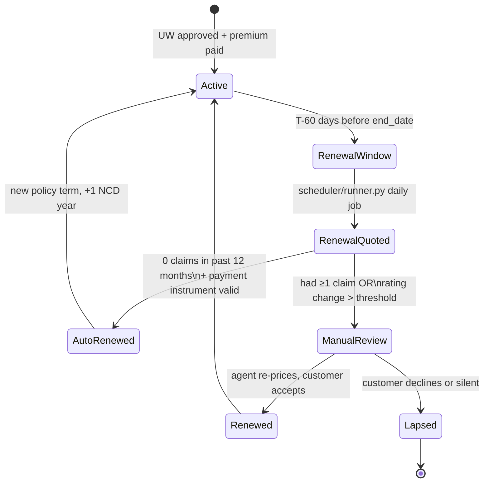

# Phins Ryders — General Insurance Division: Architecture Research

> **Status:** Research / design only. No code changes proposed in this branch.
> **Audience:** Founder, architecture review, underwriting & claims leads.
> **Goal:** Decide *how* to add a second insurance ecosystem ("Phins Ryders" – general / P&C insurance) on top of the existing PHINS (Life & Health) platform, without breaking the data integrity that PHINS already enforces (audit log + hash‑chained `platform_ledger_entries`).

---

## 1. Executive Summary

PHINS today is a **single‑division** platform whose business logic, dashboards, underwriting bot, actuarial tables and wallets are tuned for **Life, Health, Disability and Savings** products. The `policies.type` column already accepts `auto`, `property`, `business` values, but everything *around* the column (UW rules, premium math, claims workflow, dashboard widgets, AI reports, investment side‑bar) assumes Life & Health.

The user's request is to add a **parallel insurance division** — *Phins Ryders* — focused on **general insurance** (motor, property/home, apartment, small commercial) with:

- different actuarial tables (motor frequency/severity, property fire/escape‑of‑water, etc.)
- different underwriting requirements (vehicle inspection, building survey, no medical exam)
- annual premiums with **automatic renewal on a clean‑claims year**
- a different wallet concept ("damages wallet" — garages, plumbers, towing, restoration vendors) instead of the Health Wallet
- **no** investments / AI investments / AI reports / risk‑assessment‑bot tabs
- but **shared** customer identity, KYC, payment instruments, supplier ecosystem and ledger.

After reviewing the codebase and surveying how composite insurers (SAP Fioneer, Oracle OIPA, Prima L&H, Altkom AIS, Guidewire/Duck Creek patterns) handle multi‑line operations, this document recommends:

> **Option B — Shared Core + Division Layer**, exposed to users through a **Division Switcher** (Option C front‑door pattern) at sign‑in / on the dashboard.
>
> One database, one customer master, one supplier master, one audit/ledger spine. **Two policy/claims/wallet "bounded contexts"** (`life_health` and `general`) implemented as separate service modules and separate dashboards, sharing the same `Customer`, `User`, `Supplier`, `Document`, `AuditLog` and `PlatformLedgerEntry` tables.

This avoids the worst failure mode of composite insurers — **forking the customer record into two ecosystems that drift apart** — while still letting Phins Ryders evolve at its own pace, with its own UW rules and its own UI surface area.

**Nothing is built in this branch.** Section 11 lists the concrete change‑points if/when the decision is approved.

---

## 2. Where PHINS is Today (Baseline)

Evidence from the codebase (verified files cited inline):

| Concern | Today | Notes |
|---|---|---|
| Customer master | One unified table `customers` (auth fields included) | `database/models.py` lines 56‑127 |
| Policy table | Single `policies` row with `type` string (`life`, `health`, `auto`, `property`, `business`) | `database/models.py` lines 130‑194 |
| Policy JSON sub‑object | `health_wallet` field on every Policy | `database/models.py` line 155 |
| Underwriting | One `underwriting_applications` table heavily skewed to medical (BMI, smoking, ADLs, disability %) | `database/models.py` lines 273‑329 |
| Actuarial | `ActuarialTablesStore` ships **mortality, disability, lapse, ADL** defaults only | `services/actuarial_service.py` lines 346‑799 |
| Claims | One `claims` table; `payment_destination` defaults to `health_wallet` | `database/models.py` lines 197‑270 |
| Suppliers | Already generic; `supplier_type` and `category` fields support healthcare, legal, logistics, **and** can carry `garage`, `plumber`, `restoration` with no schema change | `database/models.py` lines 1127‑1180 |
| Audit / lineage | Append‑only `audit_logs` + hash‑chained `platform_ledger_entries` (`sequence_no`, `previous_hash`, `entry_hash`) — designed to be the spine of *any* division | `docs/platform_data_architecture.md` |
| API surface | Monolithic `web_portal/server.py` (~44k lines) + `api_extensions.py`, `api_bi_analytics.py`, `api_delivery_bidding.py` | per `AGENTS.md` |
| UI | `web_portal/static/dashboard.html` (~8.6k lines) bundles every widget into one screen | one screen, no division concept |

**Two important facts that make this much easier than it looks:**

1. The **schema already supports a `type` discriminator** on policies. We do not have to fork tables — we have to fork *behavior*.
2. The **supplier ecosystem is already domain‑agnostic** (`supplier_type` / `category` are free‑form strings). Garages and plumbers can be onboarded with the existing `Supplier` model unchanged.

Conversely, three things are **deeply Life‑&‑Health‑coupled** and must be isolated before a Ryders dashboard can sit beside them honestly:

- the underwriting application schema and bot
- the actuarial defaults and pricing helpers (`calculate_age_adjusted_premium`, mortality multipliers)
- the dashboard HTML (one giant page mixing investments, AI reports, savings, foundation, health wallet)

---

## 3. What Composite Insurers Do (Industry Scan)

From the published architectures of SAP Fioneer, Oracle OIPA, Prima L&H, Altkom AIS and the standard Guidewire / Duck Creek separation, three patterns dominate:

| Pattern | Who uses it | Wins | Loses |
|---|---|---|---|
| **Two PAS, two CRMs** (full replication) | Many legacy composite insurers (Aviva, AXA historically) | Total isolation, independent regulators per LOB | Customer record drifts; cross‑sell broken; two of every integration |
| **Two PAS, one customer / party hub** (shared kernel) | Modern stacks (Fioneer, OIPA when consolidated, Altkom AIS Entities Registry) | Single customer 360, MDM dedup, cross‑sell, one KYC, one payment instrument vault | Requires a clean party/identity bounded context up front |
| **One PAS, configurable product engine** (single platform, many products) | Greenfield insurtechs (Lemonade, Coalition, Wefox to a degree) | Cheapest to operate; one team | Hardest UW rule isolation; tax/regulator separation is fiddly when you grow |

Industry data: **66% of life/annuity carriers operate ≥ 2 policy admin systems**; consolidation projects routinely fail due to scope creep. The clear modern direction is **composable architecture** — *shared* identity / payments / ledger, *separate* product engines per LOB, *one* customer 360.

That maps almost directly onto what PHINS already has: an audit/ledger spine (shared kernel) and a monolithic Life/Health product engine. We just need to peel out a second product engine.

---

## 4. Three Options for PHINS

### Option A — Full Replication (separate stack)

Spin up `phins-ryders` as a second deployment with its own DB, its own portal, its own admin. Sync the customer list nightly.



- **+** Maximum isolation; one division can't break the other.
- **+** Different regulators / data residency easy.
- **−** Customer drifts immediately (two `CUST‑…` ids per person).
- **−** Two billing engines, two payment vaults, two suppliers, two audit chains. Each fix doubles in cost.
- **−** Cross‑sell ("you have a life policy, want to add motor?") is reduced to email marketing.
- **−** Throws away the hash‑chained `platform_ledger_entries` invariant — two chains can't be reconciled into one truth.

**Verdict: rejected.** PHINS' founding invariant is *one* tamper‑evident lineage. Don't fork it.

### Option B — Shared Core + Division Layer (recommended)

One database, one customer master, one supplier master, one audit/ledger spine. **Behaviour** is forked along a `division` discriminator. Per‑division services own UW, actuarial, pricing, claims workflow and wallet semantics.



- **+** One customer record, one KYC, one payment vault — true 360.
- **+** One audit chain, one ledger — `platform_ledger_entries` integrity invariant preserved.
- **+** Cross‑sell, unified billing, one statement to the customer.
- **+** Suppliers already polymorphic (garage = `supplier_type='garage'`).
- **+** Each division can ship UI / UW rules / actuarial tables independently.
- **−** Requires a **discriminator column** (`division`) on `policies`, `claims`, `bills`, `underwriting_applications`, and tenancy guards on every read path.
- **−** Requires the dashboard to be **split** (or at least slot‑ised) into two division views.

**Verdict: recommended.** Cheapest path that keeps PHINS' integrity story intact and matches what modern composite carriers do.

### Option C — Gateway / Router Front Door (the *user‑facing* shape of Option B)

Not really an alternative to B — it's the **UX wrapper** for B. After login the user lands on a **Division Selector**:

```
+-------------------------------------------------+
|                  Welcome, Yarden                |
|                                                 |
|   Which insurance division would you like to    |
|                  enter today?                   |
|                                                 |
|   +-----------------+    +-----------------+    |
|   |    🛡️  PHINS    |    |  🏎️  Phins      |    |
|   |  Life & Health  |    |     Ryders       |    |
|   |                 |    |  General Ins.    |    |
|   |  [ Enter ]      |    |  [ Enter ]       |    |
|   +-----------------+    +-----------------+    |
|                                                 |
|   You currently have: 2 L&H policies, 0 GI.     |
+-------------------------------------------------+
```

The selector simply sets a `division` context on the session and routes to the corresponding dashboard. Same back‑end database, same identity, same wallet vault. It is the operational manifestation of "two divisions, one company".

> **Conclusion of Section 4:** **Adopt B (architecture) + C (entry UX).** We treat them as one solution.

---

## 5. Recommended Bounded Contexts



**Rules:**

1. The shared kernel knows **nothing** about divisions. It exposes `Customer`, `Supplier`, `Document`, `PaymentInstrument`, `AuditService`, `PlatformEventLedgerService`, `BillingEngine`, `NotificationService` and that's it.
2. Every row in **division‑specific** tables (`policies`, `claims`, `bills` for those policies, `underwriting_applications`) carries a `division` column (`life_health` | `general`).
3. Division services may **read** kernel data; the kernel never imports a division module.
4. `platform_ledger_entries` gets a `division` field in its payload (not a new table) so BI can slice by LOB while integrity stays one chain.
5. Suppliers tag themselves with the division(s) they serve via a `supplier_divisions` JSON array — a doctor is `["life_health"]`, a garage is `["general"]`, a tow company could be both if it ever ferries patients.

---

## 6. Data Model Delta

Minimal, additive, non‑destructive changes. **No table renames, no column drops.**



**Migration is two ALTER TABLEs and a backfill:**

```sql
ALTER TABLE policies                    ADD COLUMN division TEXT NOT NULL DEFAULT 'life_health';
ALTER TABLE claims                      ADD COLUMN division TEXT NOT NULL DEFAULT 'life_health';
ALTER TABLE underwriting_applications   ADD COLUMN division TEXT NOT NULL DEFAULT 'life_health';
ALTER TABLE bills                       ADD COLUMN division TEXT NOT NULL DEFAULT 'life_health';

-- Suppliers: keep all existing rows visible to L&H; admins later tag any
-- supplier as also serving 'general'.
ALTER TABLE suppliers                   ADD COLUMN supplier_divisions TEXT
    DEFAULT '["life_health"]';
```

The defaults guarantee **every existing row stays in the L&H division** — no behaviour change for current customers, current claims, current bills. The Ryders division literally cannot exist for any historical row until a human creates one.

---

## 7. Service Layer Layout

Suggested module placement (no code yet):

```
services/
├── shared/                         # the kernel (just a refactor target)
│   ├── customer_service.py
│   ├── identity_service.py
│   ├── payment_vault_service.py
│   ├── supplier_service.py         (existing supplier_management_service.py)
│   ├── document_service.py
│   ├── audit_service.py            (already exists)
│   ├── platform_event_ledger_service.py (already exists)
│   ├── billing_service.py          (already exists; division-aware)
│   └── notification_service.py     (already exists)
│
├── life_health/                    # everything currently in services/, scoped
│   ├── lh_underwriting_service.py
│   ├── lh_actuarial_service.py     (mortality / morbidity / ADL / lapse)
│   ├── lh_claims_service.py
│   ├── lh_health_wallet_service.py
│   └── lh_pricing.py
│
└── general/                        # NEW — Phins Ryders
    ├── gi_underwriting_service.py  (vehicle, property survey, NCD, perils selection)
    ├── gi_actuarial_service.py     (motor frequency-severity, fire, EoW, liability)
    ├── gi_claims_service.py        (FNOL, adjuster routing, salvage/subrogation)
    ├── gi_damages_wallet_service.py
    ├── gi_renewal_service.py       (auto-renew on clean year)
    └── gi_pricing.py
```

The HTTP layer routes by URL prefix:

```
/api/lh/...        → life_health services
/api/gi/...        → general services
/api/customer/...  → shared kernel (no division)
/api/supplier/...  → shared kernel (filtered by supplier_divisions)
/api/billing/...   → shared kernel (joins on policy.division)
```

Existing endpoints keep working: anything that doesn't say `/lh/` or `/gi/` falls through to today's handlers, which are implicitly `division='life_health'`.

---

## 8. UML — Behavioural Views

### 8.1 Sequence: New Motor Application via Phins Ryders



Note step 5: even though the request is GI, the customer lookup goes to the **shared** kernel. The `audit_logs` row at step 11 and the `platform_ledger_entries` row at step 12 land on the **same chain** as every L&H event — that is the integrity invariant we are protecting.

### 8.2 Sequence: Damages Claim → Garage Wallet Payout



The **only new service** here is `gi_damages_wallet_service`. `supplier_service` is the existing one — garages just live in the same `suppliers` table with `supplier_type='garage'`.

### 8.3 State: Annual Auto‑Renewal on a Clean Year



This is implemented as a daily scheduled job in `scheduler/runner.py` filtering for `division='general' AND end_date BETWEEN now+60d AND now+30d`.

---

## 9. UI — Demonstrated Screens

ASCII wireframes only — these are spec, not pixel mocks.

### 9.1 Division Switcher (post‑login landing, when customer has cover in both)

```
┌──────────────────────────────────────────────────────────────────┐
│  PHINS                                       Yarden ▾   ⚙   ⏻  │
├──────────────────────────────────────────────────────────────────┤
│                                                                  │
│            Choose your insurance division                        │
│                                                                  │
│   ┌────────────────────────────┐  ┌────────────────────────────┐│
│   │  🛡️  PHINS                  │  │  🏎️  Phins Ryders           ││
│   │  Life & Health              │  │  General Insurance          ││
│   │                             │  │                             ││
│   │  • 2 active policies        │  │  • 1 active policy (Motor)  ││
│   │  • Health Wallet $1,240     │  │  • Damages Wallet $0        ││
│   │  • Next premium May 22      │  │  • Auto-renews 2027-05-06   ││
│   │                             │  │                             ││
│   │  [ Enter Life & Health → ]  │  │  [ Enter Phins Ryders → ]   ││
│   └────────────────────────────┘  └────────────────────────────┘│
│                                                                  │
│   New here?  [ Apply for Motor ] [ Apply for Home ] [ Apply Life]│
│                                                                  │
└──────────────────────────────────────────────────────────────────┘
```

### 9.2 Phins Ryders Dashboard

Note what is **not** there: investments, AI investments, AI reports, risk‑assessment‑bot, foundation, savings, health wallet.

```
┌──────────────────────────────────────────────────────────────────┐
│  🏎️ PHINS RYDERS  ▾  General Insurance      Yarden ▾   ⚙   ⏻   │
│  ◀ Switch to Life & Health                                       │
├──────────────────────────────────────────────────────────────────┤
│  My Policies                              [ + Apply for cover ]  │
│  ┌────────────────────────────────────────────────────────────┐  │
│  │  MTR-2026-00042   Motor Comprehensive                      │  │
│  │  2018 Honda Civic • Tel-Aviv • NCD 4 yrs                   │  │
│  │  Premium  $1,840 / yr   Status ●Active   Renews 2027-05-06 │  │
│  │  [ File a claim ]  [ Pay premium ]  [ Documents ]          │  │
│  └────────────────────────────────────────────────────────────┘  │
│                                                                  │
│  Damages Wallet               Open Claims          Quick Actions │
│  ┌──────────────────┐  ┌──────────────────────┐  ┌────────────┐ │
│  │  Available  $0    │  │  No open claims      │  │ Find garage │ │
│  │  In review  $0    │  │                      │  │ Find plumber│ │
│  │  Released   $0    │  │  [ File new FNOL ]   │  │ Roadside    │ │
│  │  [ History ]      │  │                      │  │ Tow         │ │
│  └──────────────────┘  └──────────────────────┘  └────────────┘ │
│                                                                  │
│  Renewal Status                                                  │
│  ┌────────────────────────────────────────────────────────────┐  │
│  │  ✓ Clean-claims year so far. Auto-renewal scheduled.       │  │
│  │  ▣ Payment instrument on file (•••• 4242). [ Manage ]      │  │
│  └────────────────────────────────────────────────────────────┘  │
└──────────────────────────────────────────────────────────────────┘
```

### 9.3 Motor Application Wizard (vs. the existing Life Application)

```
Step 1/4  Vehicle              Step 2/4  Driver(s)        Step 3/4  Cover
┌─────────────────────────┐    ┌─────────────────────┐    ┌─────────────────┐
│ Plate           [____]  │    │ Driver  [Yarden A.]  │   │ ◉ Comprehensive  │
│ Make/Model      [Honda] │    │ DOB     [1989-…]     │   │ ◯ Third-party    │
│ Year            [2018]  │    │ Lic. since [2007]    │   │ ◯ TPF&T          │
│ Use   [Personal   ▾]    │    │ Claims past 5y [0]   │   │                  │
│ Annual km       [12000] │    │ Convictions    [0]   │   │ Add-ons:         │
│ Garaged at PIN  [69500] │    │ Add another driver + │   │ ☐ Roadside       │
│ [ Inspection photos ⤴ ] │    │                      │   │ ☐ Glass          │
└─────────────────────────┘    └─────────────────────┘    │ ☐ Personal acc.  │
                                                          └─────────────────┘
                                              Step 4/4  Review & Pay
                                              Annual premium  $1,840
                                              First instalment $153 / mo
                                              [ Confirm & Activate ]
```

No medical questions. No BMI. No ADLs. Underwriting decision is driven by `gi_underwriting_service`, not the existing `underwriting_assistant` / health bot.

### 9.4 FNOL (First Notice of Loss) for Property Damage

```
┌──────────────────────────────────────────────────────────────────┐
│  File a Damages Claim                    Policy: HOM-2026-00017  │
├──────────────────────────────────────────────────────────────────┤
│  What happened?                                                  │
│   ◯ Burst pipe / water damage                                    │
│   ◉ Burglary / theft                                             │
│   ◯ Fire / smoke                                                 │
│   ◯ Storm / wind                                                 │
│   ◯ Other …                                                      │
│                                                                  │
│  When?     [ 2026-05-04 ]   Where?  [ Apartment, kitchen ]       │
│  Estimated loss   $ [ 4,200 ]                                    │
│                                                                  │
│  Evidence                                                        │
│  [ ⤴ Upload photos ]  [ ⤴ Police report ]  [ ⤴ Receipts ]       │
│                                                                  │
│  Need a vendor right now?                                        │
│  ☑ Find me an approved plumber from the Phins Ryders network     │
│                                                                  │
│  [ Submit FNOL ]                                                 │
└──────────────────────────────────────────────────────────────────┘
```

The vendor lookup hits the **shared** `supplier_service` filtered by `category='plumbing'` and `supplier_divisions includes 'general'`.

---

## 10. Data Integrity Guarantees

What stays true after Phins Ryders is added:

1. **One customer → one `customers.id`** across both divisions. Cross‑sell, KYC, AML, do‑not‑contact lists all work.
2. **One `audit_logs` table, one `platform_ledger_entries` chain.** Every Ryders action lands on the same hash chain as L&H. Section 8 sequences show this. The `division` field in the payload lets BI slice by LOB without breaking the chain.
3. **Tenancy guard at the repository layer.** Every read/write of `policies`, `claims`, `bills`, `underwriting_applications` MUST pass a `division` parameter (or `None` for cross‑division admin views). Middleware in the Ryders endpoints injects `division='general'`; in L&H endpoints injects `division='life_health'`.
4. **Backfill is safe.** All historical rows default to `division='life_health'`. The first Ryders row is created only by an authenticated GI flow.
5. **Suppliers stay one ecosystem.** Suppliers tag the divisions they serve; admin can promote a vendor from L&H‑only to both. No data duplication.
6. **Billing stays one engine.** A single customer statement can show Motor + Health on one invoice, or two invoices, depending on policy preference. The `bills` table already supports multiple bills per customer.
7. **Wallets are typed, not duplicated.** `health_wallet` and `damages_wallet` are two `wallet_type` values on the same wallet model — same ledger semantics, same hold/release/payout primitives, same audit trail.
8. **The pipeline integrity service** (`services/pipeline_integrity_service.py`) gains a `division` filter parameter; the function signature stays backward compatible (`division=None` = all).

What we explicitly **do not** do:

- Do **not** create `policies_general` / `claims_general` tables. That re‑creates Option A in disguise and breaks the single ledger.
- Do **not** copy the customer record. Ever.
- Do **not** fork `audit_logs`.

---

## 11. If‑and‑When Implementation Plan (NOT executed in this branch)

Phased, additive, each phase shippable on its own.

| Phase | Scope | Files touched | Risk |
|---|---|---|---|
| **P0 — schema** | Add `division` columns + `supplier_divisions` with safe defaults | `database/models.py`, new Alembic‑style migration in `database/migrations/`, `database/seeds.py`, `database/repositories/policy_repository.py`, `claim_repository.py`, `billing_repository.py`, `underwriting_repository.py`, `supplier_repository.py` | Low — additive only |
| **P1 — kernel refactor** | Move (don't rewrite) Customer/Identity/Payment/Document into a `services/shared/` package; add `division` parameter (default `None`) to repository read methods; introduce a `RequestDivisionContext` helper in `web_portal/server.py` | `services/`, `web_portal/server.py`, `web_portal/api_extensions.py` | Medium — touches many imports |
| **P2 — GI bounded context** | New `services/general/` modules (UW, actuarial, claims, damages wallet, renewal); new endpoints under `/api/gi/*`; new `web_portal/api_general_insurance.py` extension | new files only | Low — orthogonal |
| **P3 — Division Switcher UI** | New `web_portal/static/division-select.html`; new `phins-ryders-dashboard.html`; minimal JS to set `division` cookie/header | new HTML files, login redirect tweak | Low |
| **P4 — Garage / plumber onboarding** | Seed supplier categories `garage`, `plumbing`, `restoration`, `towing`, `glass`; admin UI in `admin-supplier-dashboard.html` to tag `supplier_divisions` | `web_portal/static/admin-supplier-dashboard.html`, `services/supplier_management_service.py` | Low |
| **P5 — Auto‑renewal job** | New `scheduler/runner.py` task that scans GI policies in renewal window with clean‑claims gate | `scheduler/runner.py`, `services/general/gi_renewal_service.py` | Medium — money movement |
| **P6 — BI & ledger reporting** | Extend `services/bi_analytics_service.py` to slice by `division`; extend `services/pipeline_integrity_service.py` to validate per‑division coverage | `services/bi_analytics_service.py`, `services/pipeline_integrity_service.py` | Low |
| **P7 — Decommission L&H‑only assumptions** | Audit `web_portal/server.py` for hard‑coded `'health_wallet'` / `'life'` assumptions; replace with division‑aware helpers | `web_portal/server.py` (~44k lines, careful) | Medium — bulk find‑replace |

Per AGENTS.md hard rules: each phase keeps the existing JSON error / pagination shapes, reuses existing helpers (`status_eq`, `safe_float`, `get_customer_with_fallback`, etc.), and ships with tests against both DB and in‑memory flows.

---

## 12. Risks & Open Questions

These should be resolved before a single line of P0 lands.

1. **Regulatory split.** Some jurisdictions require *legally separate* entities for life vs. general insurance (e.g. EU Solvency II, Israeli כללי vs. חיים licensing). If true for the launch market, the recommended Option B still works at the **operational** layer, but financial reporting (`services/financial_reporting_service.py`, `services/reserves_reporting_service.py`) needs a hard `division` partition for solvency capital. **→ Confirm licensing posture per launch country.**
2. **Reinsurance.** GI uses very different treaty structures (XL, surplus, quota share on motor) than L&H. The existing `services/reinsurance_service.py` is L&H‑centric. Likely needs a sibling, not a fork.
3. **Claims fraud signals.** Motor‑claim fraud (staged collisions) is a fundamentally different model from health‑claim fraud (provider upcoding). Don't try to reuse the existing fraud heuristics — Ryders needs its own.
4. **Renewal pricing fairness.** "Auto‑renew on clean year" sounds simple but rate increases on renewal are heavily regulated (UK FCA Pricing Practices, NAIC model laws in the US). Need a documented rate‑change policy before P5.
5. **Cross‑sell consent.** Using the same `customers` row for marketing across divisions may need an explicit re‑consent under GDPR/CCPA. **→ Add a `division_consents` JSON to the customer record in P1.**
6. **Damages‑wallet vs. direct supplier payment.** Two valid models — pay garage directly (cashless) or reimburse customer via wallet. Recommend supporting both via `payment_destination` field that already exists on `claims` (`damages_wallet | bank_transfer | supplier_direct`).
7. **Operational tenancy.** Adjusters, underwriters, accountants today have role flags but no division flag. `users` table needs `assigned_divisions` JSON in P1 so a motor underwriter can't see life applications and vice versa.

---

## 13. Recommendation in One Paragraph

Add Phins Ryders as a **second bounded context inside the same PHINS database and the same hash‑chained ledger**, not as a second deployment. Add a `division` discriminator to `policies`, `claims`, `underwriting_applications` and `bills` (defaulting all current rows to `life_health`). Build new `services/general/` modules for UW, actuarial, claims, damages‑wallet and auto‑renewal. Tag suppliers with the division(s) they serve. Surface the split to users with a **Division Switcher** screen at sign‑in and a **dedicated Phins Ryders dashboard** that omits investments / AI / health‑wallet widgets and adds a damages wallet, vendor lookup and FNOL flow. Keep one customer, one KYC, one payment vault, one audit chain — that is the invariant that makes "two divisions, one company" work, and it is exactly the modern pattern (SAP Fioneer, Oracle OIPA, Altkom AIS) for composite carriers.

**Do not begin implementation until the regulatory questions in §12.1 and the consent question in §12.5 are answered.**

---

*Document version 1.0 — research only, no code shipped.*
