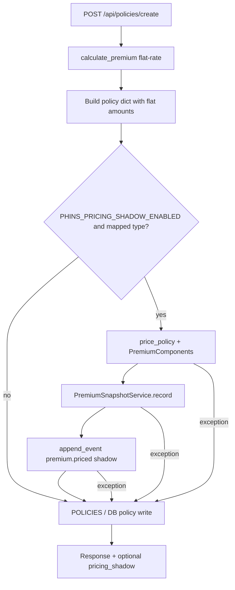

# Actuarial Shadow Pricing Dual-Run - Plan

## Goal Capsule

- **Objective:** Persist a hashed kernel `PremiumSnapshot` beside every new life/health/phins_unified policy create, while leaving billed `annual_premium` / `monthly_premium` / bills unchanged.
- **Authority:** `docs/actuarial_contract_unification_assessment.md` (origin) > this plan > existing flat-rate issuance behavior.
- **Execution profile:** Additive, fail-open shadow path; feature-flagged; no customer-facing amount change.
- **Stop conditions:** Shadow path must never fail policy create; must never mutate billed premium fields; auto/property/business stay out of kernel mapping.
- **Out of scope this plan:** Cutover to kernel billing (Phase D), risk→kernel loading wiring (Phase C), Durable Objects (Phase E), anniversary reprice jobs.

Product Contract preservation: bootstrap from assessment Phase A–B; no separate brainstorm artifact.

---

## Product Contract

### Summary

Today, `/api/policies/create` bills via flat-rate `calculate_premium`. The actuary dashboard and `pricing_kernel.price_policy` already produce versioned `PremiumComponents` with `integrity_hash`, but that output is not attached to issued policies. This plan introduces a **shadow dual-run**: compute and store the kernel price for audit/parity, keep flat-rate as the billed truth.

### Problem Frame

Without a pinned kernel snapshot at issue time, PHINS cannot prove which product/tables/config produced (or would have produced) a premium, and cannot safely cut over later without rewriting history. Shadow persistence is the integrity-preserving first step.

### Requirements

**Shadow pricing**

- R1. When `PHINS_PRICING_SHADOW_ENABLED` is truthy, life/health/phins_unified creates run `price_policy` after flat-rate calculation and persist a `PremiumSnapshot` linked to the new `policy_id`.
- R2. Billed fields `annual_premium`, `monthly_premium`, `quarterly_premium` remain exactly the flat-rate values; shadow must not overwrite them.
- R3. Shadow compute/persist/ledger failures are swallowed (logged); create still returns success with flat-rate premiums.
- R4. Auto/property/business creates skip kernel shadow (or record `skipped` with reason); no forced life kernel math.

**Snapshot contract**

- R5. Snapshot stores flat billed amounts, full kernel `PremiumComponents` (via `as_dict`), product/tables/config versions, integrity hash, and a parity delta (`kernel_annual - flat_annual`).
- R6. Snapshot is append-oriented and checksummed (AssessmentRecord pattern); never rewritten in place by create.
- R7. Optional best-effort platform ledger event `premium.priced` with `status=shadow` and payload referencing the snapshot hash; ledger failure must not fail create.

**Observability / API**

- R8. Create response may include a non-authoritative `pricing_shadow` object (`enabled`, `snapshot_id`, `integrity_hash`, `delta_annual`, `product_id`, `tables_version`) when shadow succeeded; absence must not break clients.
- R9. Flag defaults off in production-like envs; tests may enable explicitly.

### Actors

- A1. Applicant / customer portal (`apply.js` → create API)
- A2. Portal handler (`web_portal/server.py`)
- A3. Pricing kernel (`services/pricing_kernel.py`)
- A4. Actuary (consumer of future parity reports; no UI change this plan)
- A5. Platform event ledger

### Key Flows

- F1. Shadow create (mapped type)
  - **Trigger:** `POST /api/policies/create` with type in {life, health, phins_unified} and flag on
  - **Actors:** A1, A2, A3, A5
  - **Steps:** Validate → `calculate_premium` → build policy → shadow `price_policy` → persist snapshot → optional ledger → store policy with flat premiums → return response (+ optional `pricing_shadow`)
  - **Outcome:** Policy issued amounts unchanged; snapshot exists for parity
  - **Covered by:** R1–R3, R5–R8

- F2. Flag off / unmapped type
  - **Trigger:** Flag false, or type auto/property/business
  - **Steps:** Existing create path only
  - **Outcome:** No snapshot required; behavior identical to today
  - **Covered by:** R4, R9

### Acceptance Examples

- AE1. Covers R1, R2, R5
  - **Given:** Flag on, life policy coverage 500000 age 35
  - **When:** create succeeds
  - **Then:** response premiums match flat-rate only; a `PremiumSnapshot` row/dict exists with `product_id=phins_pure_risk_adjustable` (or mapped id), non-empty `integrity_hash`, and stored flat amounts equal to policy billed amounts

- AE2. Covers R3
  - **Given:** Flag on, kernel path forced to raise
  - **When:** create runs
  - **Then:** HTTP success; policy has flat premiums; no exception escapes; missing/failed shadow is acceptable

- AE3. Covers R4, R9
  - **Given:** Flag off (or auto type)
  - **When:** create runs
  - **Then:** no snapshot side effects; e2e create assertions still pass

### Success Criteria

- Dual-run evidence exists for new mapped policies when enabled.
- Zero change to billed amounts and payment paths.
- Clear product-type → kernel product map documented in code.
- Tests prove fail-open + amount freeze + snapshot shape.

### Scope Boundaries

**In scope**

- Phase A contract map constants (product type → kernel product + SPV field names)
- Phase B `PremiumSnapshot` model/service + create-hook + shadow ledger event + tests

**Deferred for later**

- Phase C: wire Assessment/UW loadings into kernel inputs
- Phase D: cut over billed amounts to kernel
- Phase E: Durable Objects
- Actuary dashboard UI for parity report
- `create_simple` shadow (optional follow-up; same helper if cheap)

**Outside this product's identity**

- Marketplace health SKU pricing_explanations
- Replacing `billing_engine` payment logic
- Bulk reprice of in-force book

### Dependencies

- Existing `price_policy` / `PremiumComponents` / `table_set_from_store`
- `ActuarialTablesStore` / `CONTRACT_SPECIFICATION` for normative product id
- AssessmentRecord fail-open persist pattern
- `PlatformEventLedgerService.append_event`

### Outstanding Questions

- Q1 (deferred): Exact dual-run tolerance bands for a future cutover dashboard — not needed to persist shadow.
- Q2 (deferred): Whether `create_simple` must shadow in the same PR — default yes if shared helper is used; otherwise follow-up.
- Q3 (deferred): DB-only vs memory+DB for snapshots in `USE_DATABASE=false` tests — follow AssessmentRecord dual-path.

### Sources

- `docs/actuarial_contract_unification_assessment.md`
- `ACTUARIAL_PRICING_MODEL.md` (legacy flat-rate truth for billed amounts)
- `services/pricing_kernel.py`, `services/actuarial_service.py`
- `docs/platform_data_architecture.md`

---

## Planning Contract

### Assumptions

- Session-settled: Phase A–B only; zero bill impact; Durable Objects out of scope for this plan.
- Kernel product for mapped types is `phins_pure_risk_adjustable` (matches `CONTRACT_SPECIFICATION`), not `phins_hybrid_savings`.
- Shadow uses live `get_actuarial_store()` tables (same as simulator), recording `tables_version` on the snapshot — freeze-at-issue of table bytes can come later if needed.
- `calculate_age_adjusted_premium`'s savings override must **not** be reused for shadow truth; call `price_policy` directly so snapshot matches actuary contract semantics.
- Env flag pattern matches `PHINS_ASSESSMENT_AI_ENABLED` (`_truthy`), not static `FEATURES` dict alone.
- Session-settled product economics (see `docs/actuarial_ld_ratio_consistency_report.md` §0): **1:4 D:L until 65; 1:1 (D=L) after 65**; table/kernel pricing; dashboard actuarial adjustments must **persist**. Shadow Phase A–B may still snapshot *current* kernel behavior (which zeros disability ≥65) for parity evidence; correcting the post-65 band + durable config is a **prerequisite/sibling** plan before cutover, not silently in scope of billed-amount freeze work.

### Key Technical Decisions

- KTD1. Side table `PremiumSnapshot`, not Policy JSON columns — session-settled: mirrors AssessmentRecord; keeps Policy schema stable; supports append-only history. Rejected: stuffing into `billing` JSON (opaque, hard to query).
- KTD2. Feature flag `PHINS_PRICING_SHADOW_ENABLED` default off — session-settled: fail-open advisory path; tests opt in. Rejected: always-on (surprises prod amounts paths / load).
- KTD3. Call `price_policy` directly for shadow, not `calculate_age_adjusted_premium` — avoids hybrid savings override that diverges from Adjustable Risk contract. Governs R1, R5.
- KTD4. Product map constant in a small module (prefer `services/pricing_shadow_service.py` or next to kernel) — `life|health|phins_unified → phins_pure_risk_adjustable`; unmapped → skip. Governs R4.
- KTD5. Ledger event `premium.priced` with `status=shadow`, `amount=0.0` (or flat monthly for reference only in payload, not as economic driver). Fail-open. Governs R7.
- KTD6. No Durable Objects in this plan — session-settled from assessment; coordination not required for shadow persist.

### Technical Design

**SPV fields recorded on each snapshot (Phase A freeze):**

| Field | Source |
|---|---|
| `product_id` | map → `phins_pure_risk_adjustable` |
| `contract_version` | `CONTRACT_SPECIFICATION['version']` |
| `tables_version` | `PremiumComponents.tables_version` / store current |
| `config_version` | `PremiumComponents.config_version` |
| `integrity_hash` | `PremiumComponents.integrity_hash` |

### Sequencing

1. U1 contract map + shadow service (pure, testable)
2. U2 model + dual-path persist
3. U3 create-handler hook + ledger
4. U4 tests + flag docs note in assessment or short comment in DEPLOYMENT only if env is operator-facing

### Implementation Constraints

- Never mutate billed premium keys on policy/bill.
- Shadow path try/except at the handler boundary.
- Preserve `{ "error": "..." }` conventions on real failures; shadow is not a client error surface.
- Prefer repository/`DatabaseManager` patterns if a repo is needed; otherwise service + model like AssessmentRecord is acceptable for v1.

---

## Implementation Units

### U1. Product map + shadow pricing service

- **Goal:** Pure helper that maps policy type → kernel product, runs `price_policy`, and builds an immutable snapshot dict (flat + kernel + delta + versions).
- **Requirements:** R1, R4, R5, R6
- **Files:**
  - `services/pricing_shadow_service.py` (new)
  - `services/pricing_kernel.py` (read-only reuse)
  - `services/actuarial_service.py` (read `get_actuarial_store`, `CONTRACT_SPECIFICATION` / `get_contract_specification`)
- **Approach:**
  - `POLICY_TYPE_TO_PRODUCT = {"life": "...", "health": "...", "phins_unified": "..."}`
  - `is_shadow_enabled()` via env `_truthy`
  - `build_shadow_snapshot(policy_dict, flat_premiums) -> Optional[dict]`
  - Build `PricingCustomer` from age/coverage/term (defaults documented); `TableSet` via `table_set_from_store`; `PricingConfig` from underwriting store config where helpers exist
  - Compute `payload_sha256` over canonical snapshot body (exclude volatile timestamps if needed)
  - Do not import `server.py`
- **Test scenarios:**
  - Mapped type returns snapshot with expected `product_id` and 16-char hash
  - Unmapped type returns `None` / skipped
  - Flat amounts echoed unchanged; delta computed
  - Flag off short-circuits without calling kernel (mock/spy)
- **Verification:** `pytest tests/test_pricing_shadow_service.py -q`

### U2. PremiumSnapshot persistence

- **Goal:** Durable (memory + optional DB) append-only store for snapshots.
- **Requirements:** R5, R6, Q3
- **Files:**
  - `database/models.py` — new `PremiumSnapshot` model near `AssessmentRecord`
  - `services/pricing_shadow_service.py` — `record_shadow_snapshot(...)`
  - `database/__init__.py` / manager wiring only if required for `create_all` discovery
- **Approach:**
  - Columns inspired by AssessmentRecord: `id`, `policy_id`, `customer_id`, `engine`, `engine_version`, `product_id`, `contract_version`, `tables_version`, `config_version`, `integrity_hash`, `flat_annual`, `flat_monthly`, `kernel_annual`, `kernel_monthly`, `delta_annual`, `details_json`, `payload_sha256`, `created_at`, `mode='shadow'`
  - In-memory list/dict for test mode; best-effort DB write when `USE_DATABASE`
  - Never update existing rows from create path
- **Test scenarios:**
  - record → get_by_policy returns same hash
  - DB disabled still keeps memory record
  - Second record for same policy appends (history), does not clobber first
- **Verification:** unit tests in `tests/test_pricing_shadow_service.py`
- **Dependencies:** U1

### U3. Create-handler dual-run hook + shadow ledger

- **Goal:** Wire shadow into `/api/policies/create` without changing billed economics.
- **Requirements:** R1–R4, R7–R9
- **Files:**
  - `web_portal/server.py` — after `premium_data = calculate_premium(data)` / policy dict build (~39670–39708)
  - optionally share helper for `create_simple` if trivial
- **Approach:**
  - After flat premiums assigned, if enabled and mapped: call `record_shadow_snapshot`; on success optionally `platform_event_ledger.append_event(event_type='premium.priced', entity_type='policy', entity_id=policy_id, customer_id=..., status='shadow', amount=0.0, payload={...})`
  - Attach `pricing_shadow` to JSON response only when snapshot recorded
  - Entire block in try/except; log warning; never raise
  - Do not call admin recalculate or billing generation changes
- **Test scenarios:**
  - AE1 via HTTP create with env flag
  - AE2 forced failure inside shadow
  - Flag off: response shape unchanged for existing fields; e2e still green
- **Verification:** `pytest tests/test_pricing_shadow_create.py tests/test_e2e_insurance_pipeline.py -q`
- **Dependencies:** U1, U2

### U4. Characterization + regression tests

- **Goal:** Lock billed-amount freeze and document operator flag.
- **Requirements:** R2, R9, AE1–AE3
- **Files:**
  - `tests/test_pricing_shadow_service.py` (new)
  - `tests/test_pricing_shadow_create.py` (new)
  - `docs/actuarial_contract_unification_assessment.md` — one-line pointer that Phase B plan exists (optional, keep minimal)
  - `DEPLOYMENT.md` or env section only if repo already documents similar `PHINS_*` flags nearby (prefer minimal: comment on flag in service module docstring)
- **Approach:**
  - Compare create premiums with flag on vs off — must be equal for same payload
  - Assert snapshot delta fields present when on
  - Keep `test_pricing_kernel.py` untouched except imports if needed
- **Test scenarios:**
  - Amount freeze matrix across life/health/phins_unified
  - Integrity hash stable for identical inputs
- **Verification:** commands in Verification Contract
- **Dependencies:** U3

---

## Verification Contract

| Gate | Command / check | Applies |
|---|---|---|
| Shadow unit | `pytest tests/test_pricing_shadow_service.py -q --tb=short` | U1, U2 |
| Shadow create | `pytest tests/test_pricing_shadow_create.py -q --tb=short` | U3, U4 |
| E2E pipeline unchanged | `pytest tests/test_e2e_insurance_pipeline.py -q --tb=short` | U3 |
| Kernel still green | `pytest tests/test_pricing_kernel.py -q --tb=short` | regression |
| Manual integrity | Create with flag on; confirm `POLICIES[id]` premiums unchanged and snapshot exists | U3 |

No `release:validate` required for this additive shadow work.

---

## Definition of Done

- All Implementation Units U1–U4 complete.
- Flag default keeps production behavior identical when unset.
- No billed premium field changes in create success path.
- AE1–AE3 covered by automated tests.
- Origin assessment remains the long-term north star; this plan does not implement Phases C–E.
- Ready for a follow-on plan: risk→kernel loading (C) or cutover (D) only after shadow data accumulates.

---

## Appendix

### Insertion point (create)

`web_portal/server.py` ~39669–39708 — after `premium_data = calculate_premium(data)` and policy dict construction; before durable store commit is ideal so `policy_id` is known.

### Patterns to copy

- Fail-open advisory: `services/assessment_record_service.py`
- Env truthy: `services/assessment_ai_service.py` `_truthy`
- Kernel call construction: `calculate_age_adjusted_premium` table/config wiring — but **without** savings override
- Ledger: `PlatformEventLedgerService.append_event` at `services/platform_event_ledger_service.py:233`

### Explicit non-goals reminder

Do not reuse `ACTUARIAL_PRICING_MODEL.md` as kernel truth; it remains billed-path documentation until Phase D.
