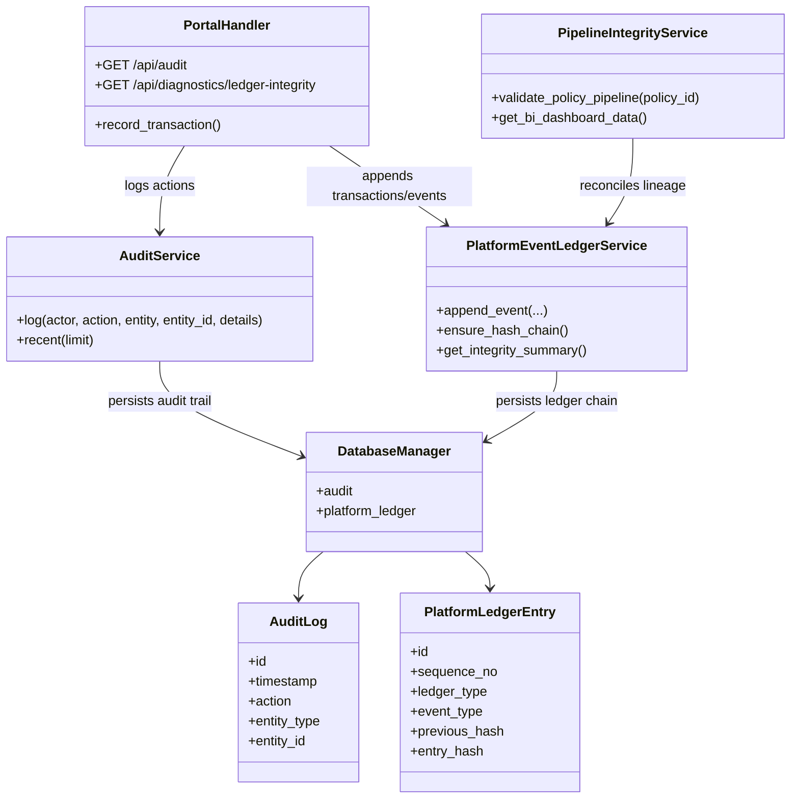
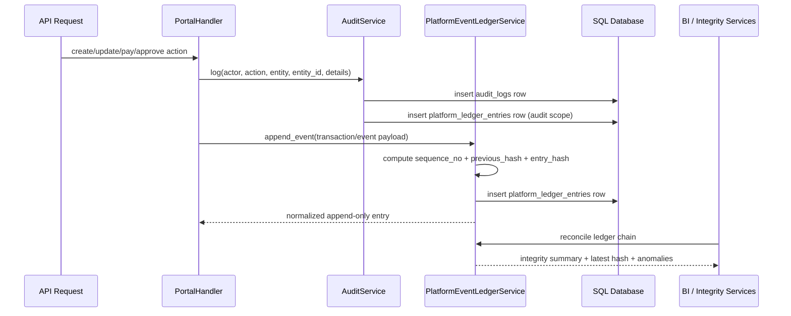

# PHINS Platform Data Architecture 2.0

## Objective

PHINS is evolving from a demo-style, mixed in-memory platform into an insurance,
health, savings, banking, investment, and actuarial operating core with durable
lineage. The target architecture below establishes one principle:

> Every critical business event must be auditable, append-only, tamper-evident,
> and reconcilable across API, workflow, BI, and actuarial views.

## Target State

### Core controls

- Operational events are persisted to `audit_logs`
- Financial and non-financial lineage is persisted to `platform_ledger_entries`
- Runtime transaction state remains backward compatible through `TRANSACTION_LEDGER`
- Ledger entries carry:
  - `sequence_no`
  - `previous_hash`
  - `entry_hash`
  - entity and customer references
  - canonical payload for replay and BI lineage
- Pipeline integrity dashboards validate ledger chain health before trusting totals

## Component UML

## Sequence UML

## Integrity contract

1. `audit_logs` capture actor/action/entity semantics.
2. `platform_ledger_entries` capture append-only lineage for all strategic events.
3. `TRANSACTION_LEDGER` remains API-compatible but is no longer a raw mutable sink.
4. BI and actuarial summaries must treat invalid ledger chains as degraded data.
5. Legacy snapshot data is repaired through hash-chain backfill on load.
6. Every metric that has more than one basis on the platform carries its basis
   label next to the number (see below). A basis label is additive metadata;
   the numeric key it describes keeps its formula.

## Customer identity master

A customer's personal (national) ID number and nationality have one writer,
`services/customer_identity_service.py`, and one durable home, the
`customers` row. Every pipeline that learns the number — registration, the
one-time login prompt, classic/chat apply, the quote form, claims, the
assessment center's Mislaka link, admin correction — goes through
`set_identity` / `reconcile_pipeline_identity`.

| Concern | Rule |
|---|---|
| Nationality | Free text ("Israel", "ISR", "ישראל", "USA", "UK") resolves to ISO 3166-1 alpha-2 via `services/countries.py`; the code is what is stored. |
| Validation | Per nationality: Israeli Teudat Zehut checksum, US SSN, UK NINO, Spanish DNI/NIE, Brazilian CPF, Italian codice fiscale, French NIR, Aadhaar; generic alphanumeric elsewhere. Separators are stripped, Israeli IDs zero-padded to 9. |
| At rest | `national_id_hash` (HMAC-SHA256 keyed by `PHINS_IDENTITY_HASH_KEY` → `PHINS_ENCRYPTION_KEY`), `national_id_last4`, `nationality`, `identity_captured_at`, `identity_source`, `identity_history`; the number itself only in `national_id_encrypted` (Fernet vault). Without a key the service refuses to store (503) unless `PHINS_TEST_MODE` / `PHINS_IDENTITY_ALLOW_PLAINTEXT_VAULT`. |
| Exposure | `Customer.to_dict()` never includes the blob. Responses, audit rows, ledger anchors and pipeline records carry `identity_reference()` = nationality + hash + last4 (+ masked). `reveal_national_id()` is server-side only (Mislaka lookup). |
| Write-once | Same value again → idempotent (`changed=false`). Different value → 409 `identity_already_set`; only an admin with a `reason` may correct, appending the previous hash to `identity_history` and anchoring `customer.identity_corrected` on the platform ledger. |
| One person, one customer | `(nationality, national_id_hash)` is checked in the service in every mode and enforced by the unique index `ux_customers_identity`. In DB mode the row is read back after the write; a write lost to the index (concurrent registration) is reported as 409 `identity_in_use` and rolled back, including the vault blob. |
| Pipelines | Records carry `customer_identity` (the reference). A payload whose ID disagrees with the recorded identity is stamped `identity_mismatch=true` for review — the customer record is never overwritten by a pipeline. `PHINS_IDENTITY_REQUIRED=true` makes applications/claims reject a missing (400 `identity_required`) or conflicting (409) identity before any row is written. |
| Existing customers | `/api/login` and `/api/session/validate` return `identity_required`; the dashboard shows a non-dismissable one-time modal that posts to `/api/customer/identity`. `/api/admin/customers/identity/report` tracks rollout completion. |

## Metric bases

Three quantities called "loss ratio" and two called "reserve requirement"
coexist. They are different numbers and are labelled as such.

| Key | Where | Basis label | Formula |
|---|---|---|---|
| `loss_ratio_pct` | `services/kpi_definitions.py`, BI KPIs | `paid_claims` | claims paid ÷ annual premium revenue (realised) |
| `risk_metrics.loss_ratio_year1` | `PortfolioSimulator` | `year1_attained_age` | expected year-1 claims at current ages ÷ annual premium |
| `risk_metrics.loss_ratio` | `PortfolioSimulator`, reinsurance band | `lifetime_annualised` | PV of expected claims over term ÷ avg term ÷ annual premium |
| `risk_metrics.reserve_requirement` | `PortfolioSimulator`, reinsurance `reserve_relief`, actuary dashboard, exports | `pv_full_term_x1.5` | 1.5 × PV of expected claims over the full remaining term |
| `summary.reserve_requirement` | `FinancialReportingService.generate_portfolio_report` | `coverage_x0.05_plus_savings_liability` | capital indication: 5 % of in-force coverage + savings liability |

`kpi_definitions.LOSS_RATIO_BASES` lists the loss-ratio labels; the reinsurance
program states `loss_ratio_basis` and `reserve_requirement_basis` so a quote
can be read against the matching basis. The Monte Carlo evaluation
(`services/monte_carlo_evaluation_service.py`) mirrors the reserve rule on the
same `pv_full_term_x1.5` basis and reports the year-1 volatility diagnostic
separately as `year1_claims_stress`.

## Recommended next increments

1. Add repository-backed persistence for health wallets, investments, and community data.
2. Replay legacy JSON snapshot state into `platform_ledger_entries` as a one-time migration.
3. Add nightly ledger reconciliation jobs and alerting.
4. Expand BI dashboards to show ledger coverage by domain: insurance, health, banking, investments, community.
