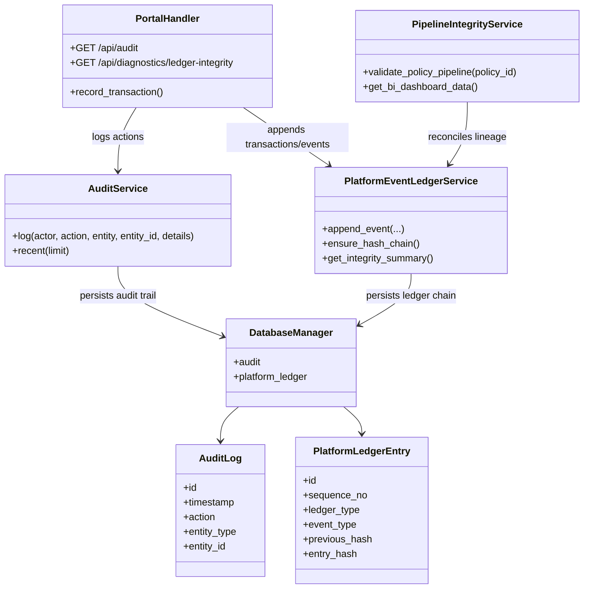
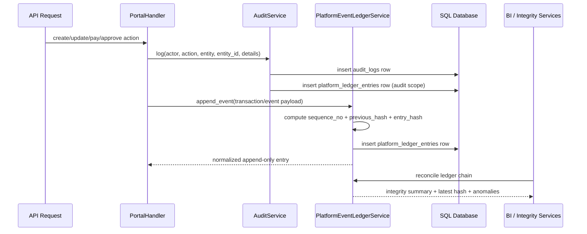

# PHINS Platform Data Architecture 2.0

## Objective

PHINS is evolving from a demo-style, mixed in-memory platform into an insurance,
health, savings, banking, investment, and actuarial operating core with durable
lineage. The target architecture below establishes one principle:

> Every critical business event must be auditable, append-only, tamper-evident,
> and reconcilable across API, workflow, BI, and actuarial views.

## Target State

### Core controls

- Operational events are persisted to `audit_logs`
- Financial and non-financial lineage is persisted to `platform_ledger_entries`
- Runtime transaction state remains backward compatible through `TRANSACTION_LEDGER`
- Ledger entries carry:
  - `sequence_no`
  - `previous_hash`
  - `entry_hash`
  - entity and customer references
  - canonical payload for replay and BI lineage
- Pipeline integrity dashboards validate ledger chain health before trusting totals

## Component UML

## Sequence UML

## Integrity contract

1. `audit_logs` capture actor/action/entity semantics.
2. `platform_ledger_entries` capture append-only lineage for all strategic events.
3. `TRANSACTION_LEDGER` remains API-compatible but is no longer a raw mutable sink.
4. BI and actuarial summaries must treat invalid ledger chains as degraded data.
5. Legacy snapshot data is repaired through hash-chain backfill on load.

## Recommended next increments

1. Add repository-backed persistence for health wallets, investments, and community data.
2. Replay legacy JSON snapshot state into `platform_ledger_entries` as a one-time migration.
3. Add nightly ledger reconciliation jobs and alerting.
4. Expand BI dashboards to show ledger coverage by domain: insurance, health, banking, investments, community.
